# Table Booking App: Find and reserve your table

Table Booking is a simple, interactive web application built with Python, Django, HTML, and CSS. It allows users to quickly check availability and reserve a table by choosing their preferred date, time, and party size.

When you open the app, you can select your booking details and submit a reservation request. The app validates your inputs, provides clear feedback if anything is missing or incorrect, and confirms successful bookings on screen. Bookings are stored in the database so you can open **View bookings** anytime and see your reservations.

The project was designed as part of the Code Institute curriculum to demonstrate:

- Responsive, mobile-first design
- User interactivity and real-time feedback
- Clean, readable, beginner-friendly code

---

## Contents

- [User Goals](#user-goals)
- [User Stories](#user-stories)
- [Website Goals and Objectives](#website-goals-and-objectives)
- [Target Audience](#target-audience)
- [Wireframes](#wireframes)
- [Design Choices](#design-choices)
  - [Typography](#typography)
  - [Colour Scheme](#colour-scheme)
  - [Images](#images)
  - [Responsiveness](#responsiveness)
- [Features](#features)
  - [Header](#header)
  - [404 Page](#404-page)
- [Database schema](#database-schema)
- [Technologies Used](#technologies-used)
  - [Languages](#languages)
  - [Libraries & Framework](#libraries-framework)
  - [Tools](#tools)
- [Testing](#testing)
  - [Bugs](#bugs)
  - [Responsiveness Tests](#responsiveness-tests)
  - [Functionality Tests](#functionality-tests)
  - [Code Validation](#code-validation)
    - [HTML](#html)
    - [CSS](#css)
    - [PYTHON AND DJANGO](#python-and-django)
  - [Accessibility Testing](#accessibility-testing)
  - [Performance Testing](#performance-testing)
  - [Browser Testing](#browser-testing)
  - [User Story Testing](#user-story-testing)
- [Deployment](#deployment)
- [Credits](#credits)    

---

## User Goals

- To quickly find and reserve a table for a specific date, time, and party size.  
- To easily understand how to make a booking with clear, step-by-step instructions.  
- To receive clear visual feedback when a booking is successful or if there is an error.  
- To review their upcoming booking details so they feel confident about their reservation.  
- To have key booking details remembered (where applicable) to speed up future reservations.  
- To book on any device, including phones, tablets, and desktops.  

---

## User Stories

- As a user, I want to see clear instructions so that I understand how to make a reservation.  
- As a user, I want to submit a booking quickly using a simple, easy-to-use form.  
- As a user, I want my booking details to be saved so I can review them later (on the site).  
- As a user, I want the app to work smoothly on both mobile and desktop so I can book from anywhere.  
- As a user, I want to edit or cancel my booking details before confirming, in case I make a mistake.  
- As a user, I want to see instant feedback if a time slot is unavailable so I can choose another option.  

---

## Website Goals and Objectives

- To provide a clear and simple layout that makes it easy for users to create and review bookings.  
- To apply responsive design principles so the booking interface works well on all devices.  
- To produce clean, well-structured code that passes HTML and CSS validators, as well as Django and Python code checks.  
- To follow a mobile-first design approach, ensuring users can book comfortably on small screens.  
- To make the website accessible, following best practices for colour contrast, labels, and instructions.  

---

## Target Audience

- Diners who want to reserve a table quickly without making a phone call.  
- People planning meals out with friends, family, or colleagues who need a reliable booking tool.  
- Users who value a simple, hassle-free way to check availability and confirm a reservation.  

---

## Wireframes

Wireframes were designed using Adobe Illustrator (My balsamiq account expired). I designed it in mobile version, tablet version, laptop version. I showed the home page, booking page and menu page within the designs and how it looks in different screen sizes.

  
Wireframe Desktop

 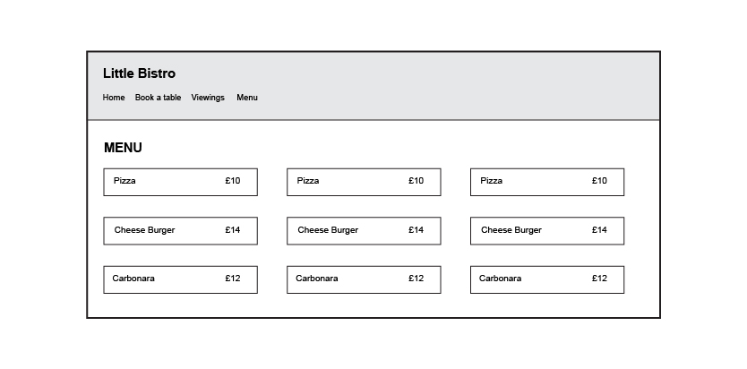

  
Wireframe Tablet

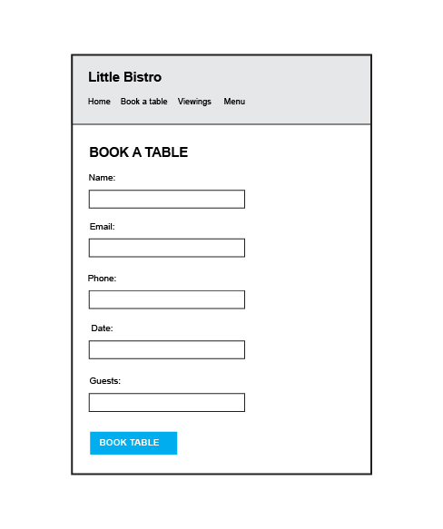

  
Wireframe Mobile

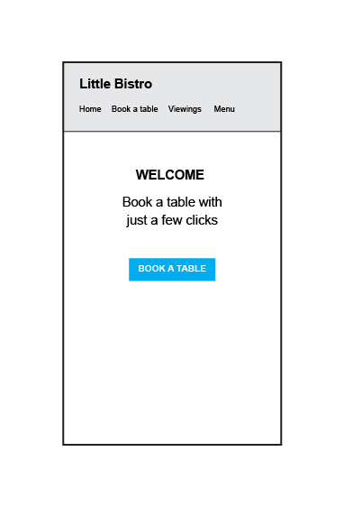

---

## Design Choices

### Typography

We chose Arial, a clean, sans-serif font with excellent readability. Its balanced letter spacing makes it ideal for both web and print. I used this font as it is common and used worldwide.

### Colour Scheme

My goal for this is to make it very minimal and simple for users to be able to navigate and book a table without any distractions.

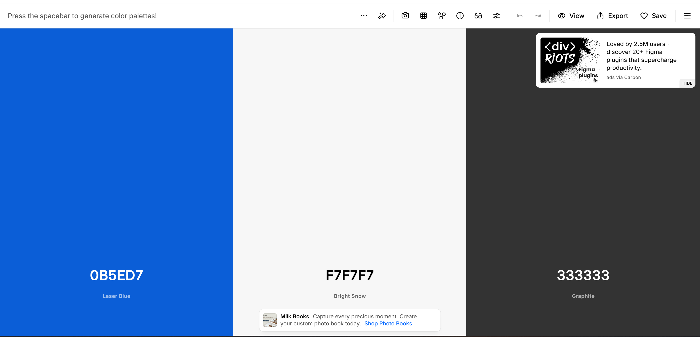

I tested it on [WAVE Tool](https://wave.webaim.org/) and had one contrast error as shown below.

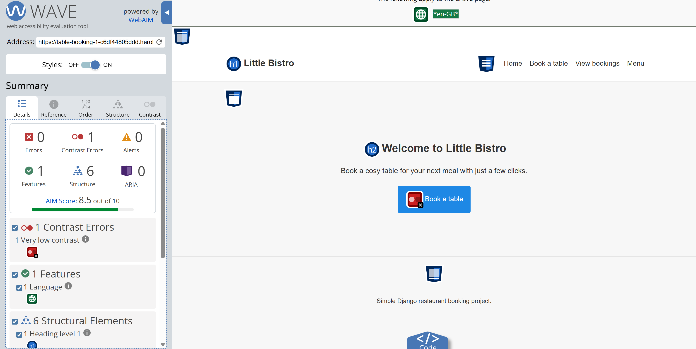

I changed the colour of the button by making it a darker blue so the white text stands out more, when I tested it again, I had no contrast errors.

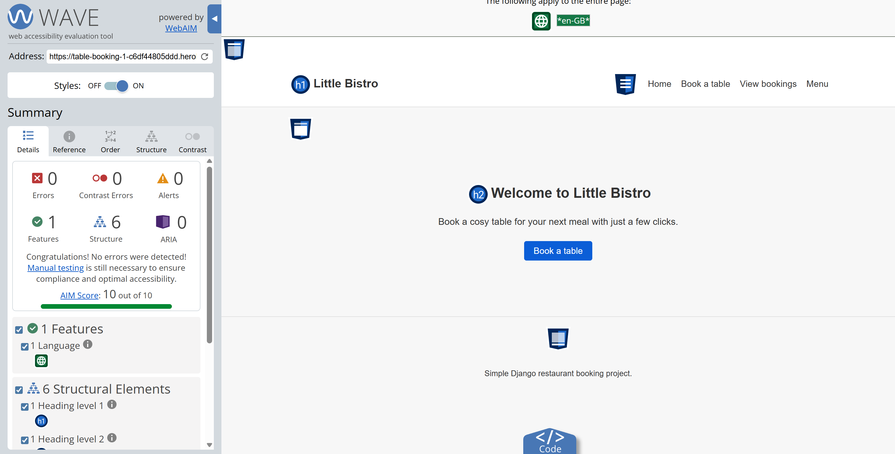

### Images

Favicon icons and logo used are from [Flaticon](https://www.flaticon.com/) 

### Responsiveness

The website was designed using a mobile-first approach, ensuring optimal user experience on smaller screens before scaling up to larger devices.

## Features

### Navigation and layout

- Simple top navigation on every page: **Home**, **Book a table**, **View bookings**, and **Menu**.
- Clean, responsive layout that works on desktop, tablet, and mobile.
- Consistent styling and readable typography (Arial) across all pages.
- Custom favicon from the `assets/favicon` folder shown in the browser tab.

  
Home Page

  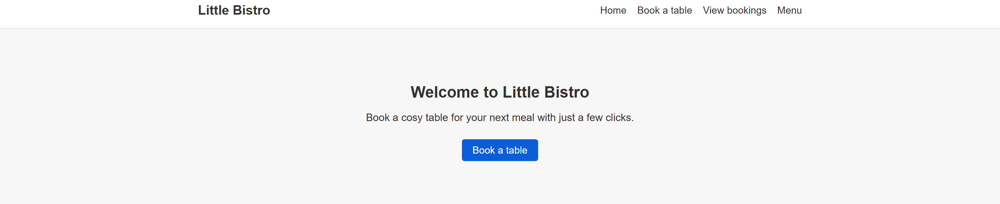

### Booking form

Users can create a booking with:

- name, email, phone
- booking date (calendar picker)
- booking time (dropdown of fixed time slots)
- table preference (e.g. near window, quiet section, near bathroom, main dining area, or not bothered)
- number of guests
- optional special request

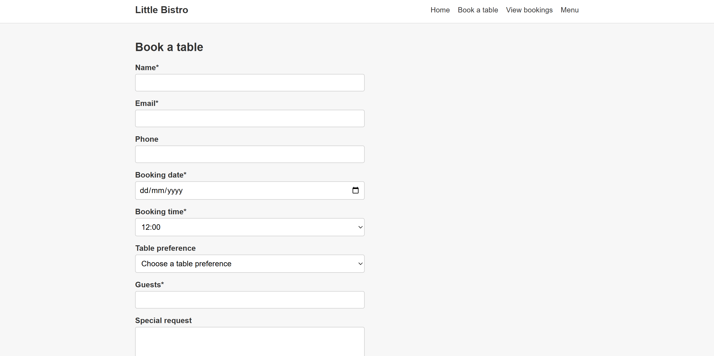

### Booking management (CRUD)

- **Create** — add a new booking from the booking form.
- **Read** — view all bookings in a table on the bookings list page.
- **Update** — edit an existing booking.
- **Delete** — remove a booking after a confirmation step.

### Validation and user feedback

- Booking date cannot be in the past.
- Guests must be at least one.
- If a table preference is selected, guest count cannot exceed that table’s seat limit.
- **Double-booking prevention** — the same date, time, and table cannot be booked twice.
- If no table is selected, a simple per-slot limit applies so the restaurant is not overbooked for that time.
- Success and error messages appear after create, update, and delete actions.

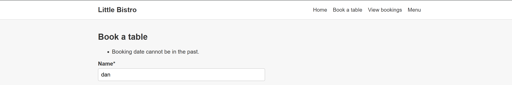

### Menu page

- A simple menu page lists sample dishes with short descriptions and prices.

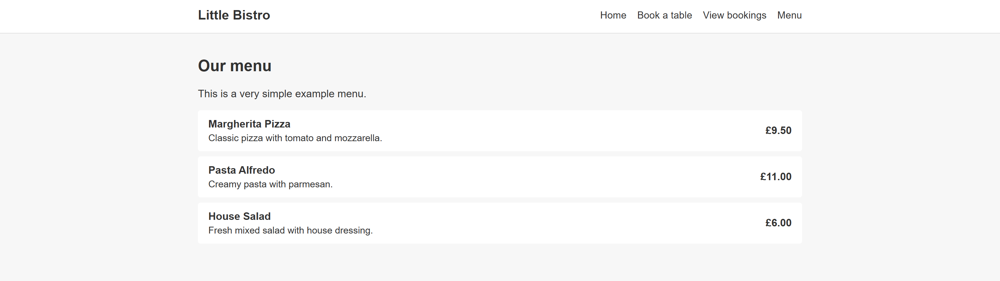

### Header

- Site title **Little Bistro** and navigation links are shown on every page for easy movement around the site.

### 404 page

- A custom **404** template (`templates/404.html`) is used when `DEBUG=False` (for example on Heroku), so unknown URLs show a friendly message and a **Go back home** link using the same layout as the rest of the site.

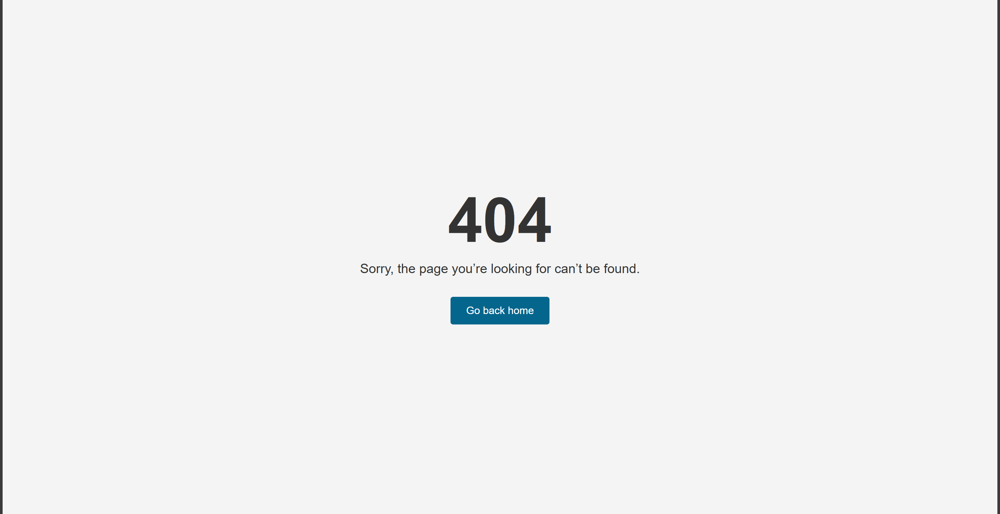

### Database schema

The app uses two main models (SQLite locally, PostgreSQL on Heroku via `DATABASE_URL`).

### `RestaurantTable`

| Field | Type | Notes |
|-------|------|--------|
| `id` | auto primary key | |
| `name` | string (max 50), unique | Table preference label (e.g. “Near window”) |
| `seats` | positive integer | Capacity for validation when guests pick this table |

### `Booking`

| Field | Type | Notes |
|-------|------|--------|
| `id` | auto primary key | |
| `name` | string (max 100) | Guest name |
| `email` | email | Contact |
| `phone` | string (max 20), optional | |
| `booking_date` | date | |
| `booking_time` | time | Fixed slots from the form |
| `table` | foreign key → `RestaurantTable`, optional | `null` = no preference |
| `guests` | positive integer | Party size |
| `special_request` | text, optional | |
| `created_at` | datetime | Set automatically when created |

**Relationship:** many bookings can reference one `RestaurantTable` (`Booking.table` → `RestaurantTable`). Validation rules (past dates, guest limits, double-booking, slot limits) are enforced in `Booking.clean()`.

### Accessibility and usability

- Button colours were adjusted for stronger contrast (checked with the WAVE tool).
- Page language is set to UK English (`en-GB`).
- Form fields are labelled clearly for easier use and screen reader support.

### Automated tests

Django tests cover:

- model validation rules
- conflict prevention (double booking and slot limits)
- booking create, update, and delete flows
- key pages returning a successful response (home, bookings list, booking form, menu)
- custom 404 page when `DEBUG=False` (as on Heroku)

## Technologies Used

### Languages

- HTML
- CSS
- Python
- Django
- Windows PowerShell

### Libraries & Framework

- [Flaticon](https://www.flaticon.com/free-icons)  

### Tools

- [Github](https://github.com/)
- [Adobe Illustrator](https://www.adobe.com/uk/)
- [W3C HTML Validation Service](https://validator.w3.org/)
- [W3C CSS Validation Service](https://jigsaw.w3.org/css-validator/)
- [Responsive Design Checker](https://responsivedesignchecker.com/)
- [WAVE Tool](https://wave.webaim.org/)
- [Page Speed Insights](https://pagespeed.web.dev/)

---

## Testing

### Bugs

One of the ways the website was tested was by using the console logs within Chrome if there are any errors. As shown in the image below, you can see that there are no bugs or errors within the google console.

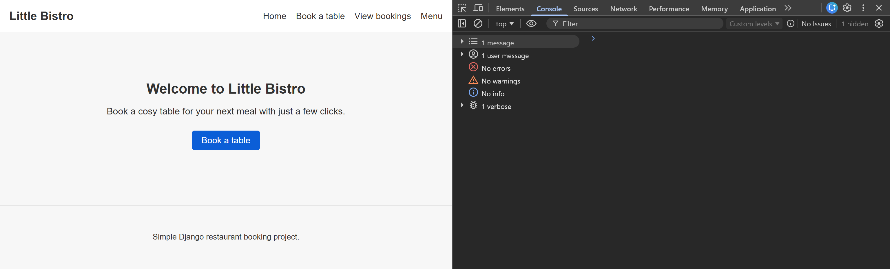

### Responsiveness Tests

To test the responsiveness, I tested the deployed versions of the website using Chrome devtools and looked at how the website looks within different devices and sizes. Below is the result.

  
Small Screen Responsiveness

  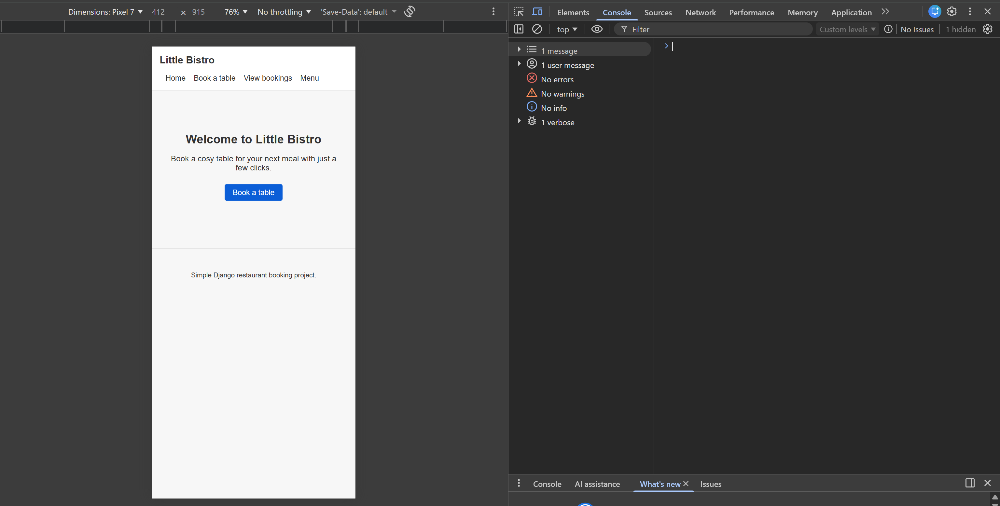

  
Medium Screen Responsiveness

  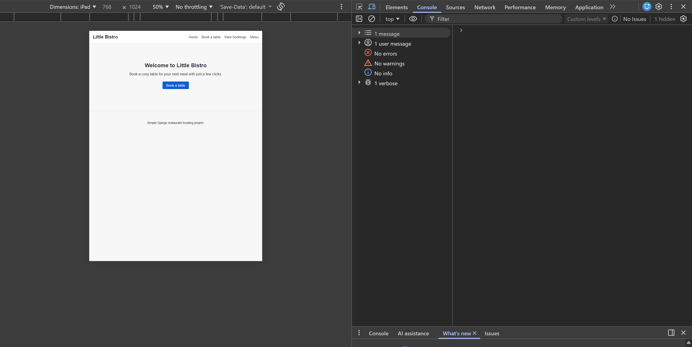

Final Test Results

| Size | Device Example         | Navigation | Element Alignments | Content Placement | Functionality | Notes                                                        |
|------|-----------------------|------------|--------------------|-------------------|---------------|--------------------------------------------------------------|
| sm   | Samsung Galaxy S6     | Good       | Good               | Good              | Good          |                                                               
| sm   | iPhone 6              | Good       | Good               | Good              | Good          |                                                              |
| sm   | iPhone 13 PRO MAX     | Good       | Good               | Good              | Good          |                                                              |
| md   | iPad MINI             | Good       | Good               | Good              | Good          |                                                              |
| md   | Galaxy Tab S7         | Good       | Good               | Good              | Good          |                                                              |
| md   | iPad Air              | Good       | Good               | Good              | Good          |                                                              |
| lg   | iPad Pro              | Good       | Good               | Good              | Good          |                                                              |
| xl   | Mackbook Air          | Good       | Good               | Good              | Good          |                                                              |
| xl   | HP Stream Laptop      | Good       | Good               | Good              | Good          |                                                              |
| xxl  | Dell Lattitude        | Good       | Good               | Good              | Good          |                                                              |
| xxl  | Desktop               | Good       | Good               | Good              | Good          |                                                              |

### Functionality Tests

I manually tested the main user journeys on the [deployed site](https://table-booking-1-c6df44805ddd.herokuapp.com/) to confirm each feature behaves as expected.

| # | Area | What I tested (steps) | Expected result | Pass / Fail |
|---|------|------------------------|-----------------|-------------|
| 1 | Home page | Open the site URL / click **Home** in the nav | Home page loads with welcome text and **Book a table** button | Pass |
| 2 | Navigation | Click each nav link: **Home**, **Book a table**, **View bookings**, **Menu** | Each page loads with no broken links and the correct content | Pass |
| 3 | Book a table — form | Go to **Book a table**, fill name, email, date, time, guests; choose **Table preference**; optional phone and special request | Form shows all fields; date uses a picker; time uses a dropdown; table is a dropdown | Pass |
| 4 | Book a table — save | Complete valid details and click **Save booking** | Success message appears; booking appears on the list | Pass |
| 5 | Book a table — validation | Try invalid input (e.g. past date, or guests higher than the table seats) | Clear error message; invalid booking is not saved | Pass |
| 6 | View bookings | Open **View bookings** after creating a booking | New booking appears in the table with name, date, time, table, guests | Pass |
| 7 | Edit booking | Click **Edit** on a booking, change details, save | Success message; list shows updated information | Pass |
| 8 | Delete booking | Click **Delete**, confirm on the confirmation page | Booking removed from list; success message | Pass |
| 9 | Menu | Open **Menu** | Menu items and prices display correctly | Pass |
| 10 | Messages | After create / update / delete | Success or error messages show at the top when appropriate | Pass |
| 11 | Responsive layout | Resize the browser (or use Chrome DevTools device mode) on Home, booking form, and list | Layout stays readable; nav and content remain usable | Pass |

### Code Validation

#### HTML

I used [W3C HTML Validation Service](https://validator.w3.org/) to test my HTML files.

I tested my html fileS and it came back with no errors or warnings.

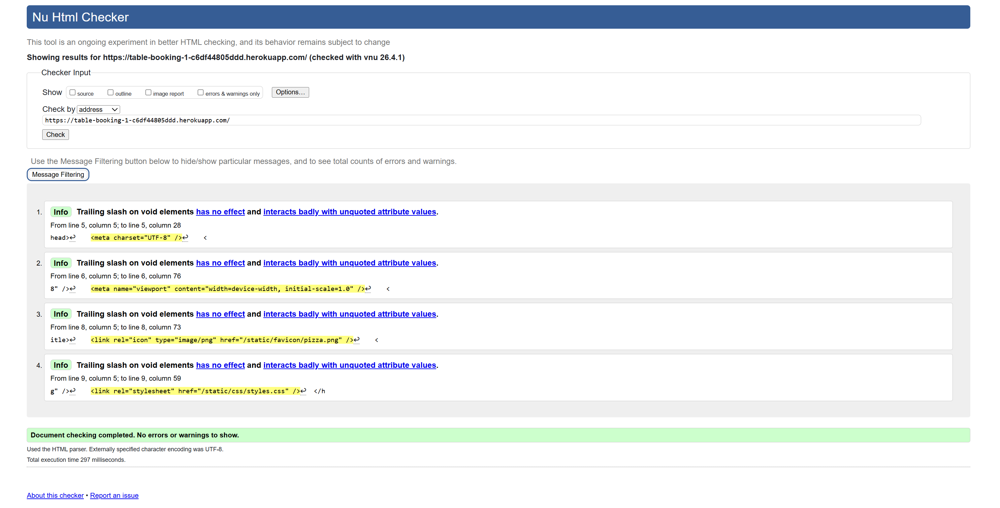

#### CSS

I used [W3C CSS Validation Service](https://jigsaw.w3.org/css-validator/) to test my CSS files.

I tested my CSS file and it came back with no errors.

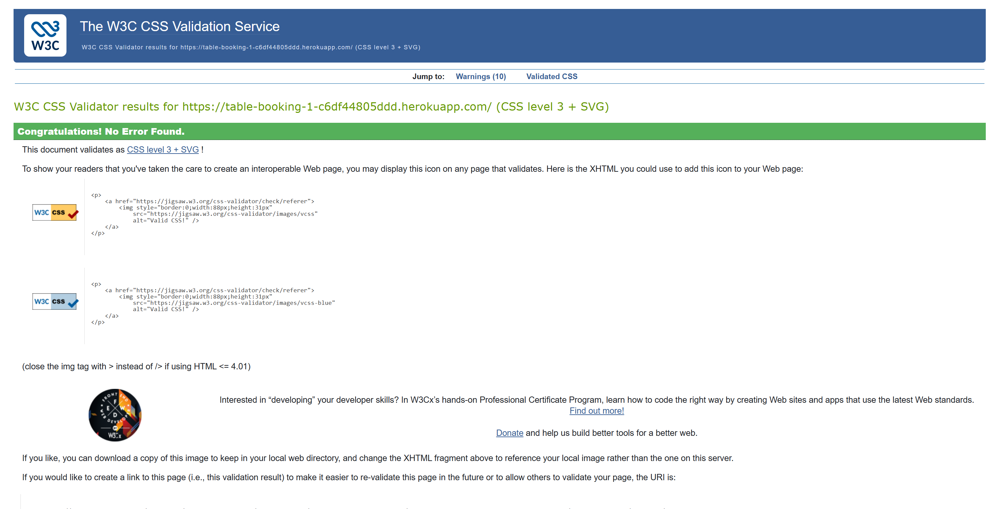

#### PYTHON AND DJANGO

I tested my django files by using my own test files and using windows powershell to run it. It came back with no errors and it passed all the checks.

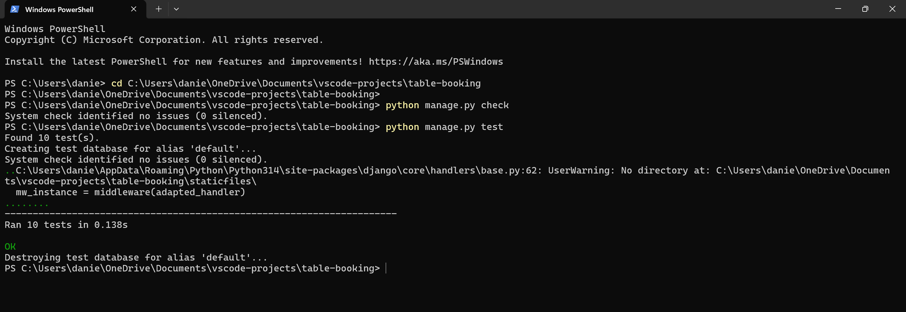

### Accessibility Testing

As stated earlier, I tested it on [WAVE Tool](https://wave.webaim.org/) and had one contrast error as shown below.

I changed the colour of the button by making it a darker blue so the white text stands out more, when I tested it again, I had no contrast errors.

### Performance Testing

I used [PageSpeed Insights](https://pagespeed.web.dev/) to test the performance of my website that includes accessibility, best practices and SEO for both mobile and desktop.

The accessibility, best practices, accessibility and SEO have came back all green with most of them being 100 out of 100 which I am happy about.

Below is the screenshot of the stats and the some of the desktop and mobile testing:

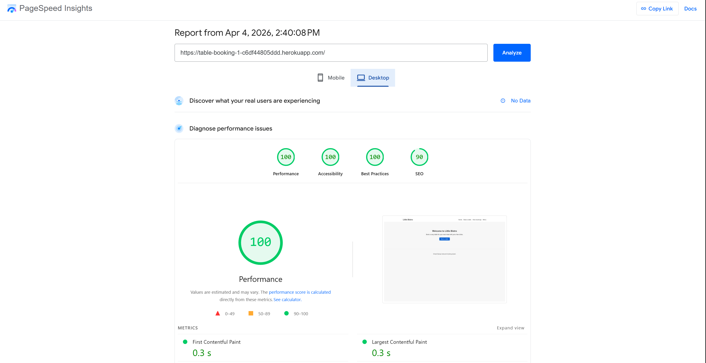

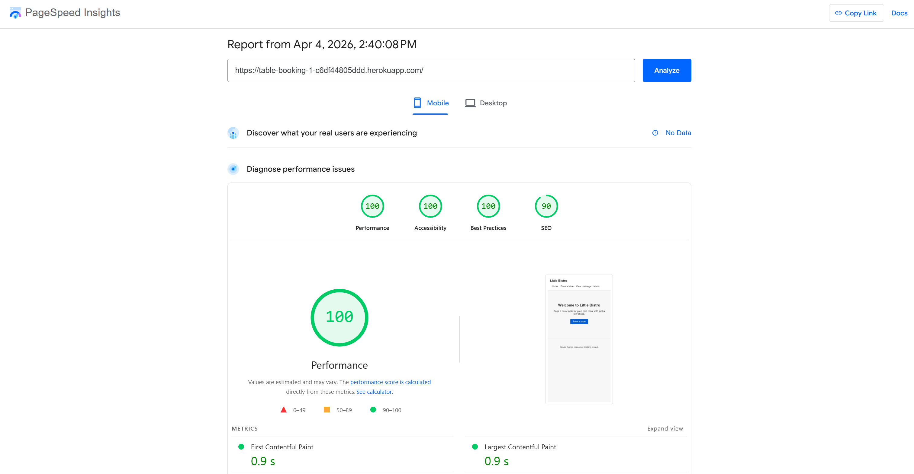

### Browser Testing

The booking table website was viewed and tested for bugs using a variety of browsers. I tested the website using Firefox, Google Chrome, and Microsoft Edge. I checked the console logs for each which there are not problems with it. The layout and look of the website on each browser looks good with no differences or problems.

  
Browser Testing Chrome

  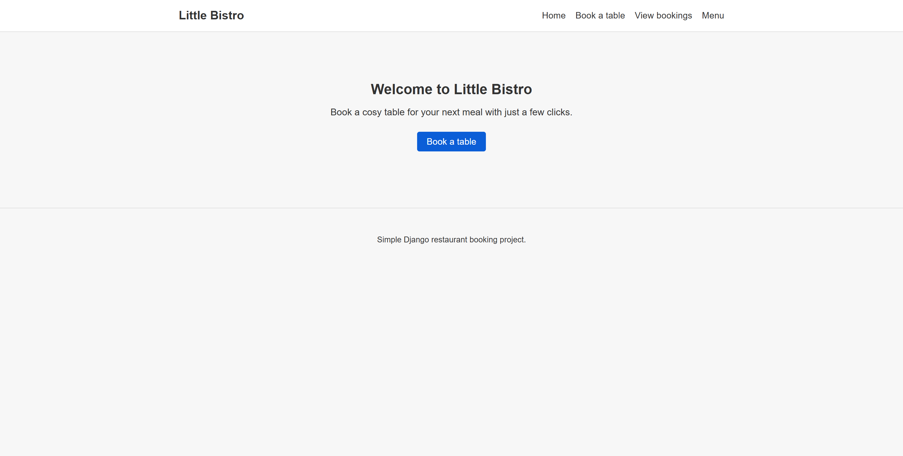

  
Browser Testing Microsoft Edge

  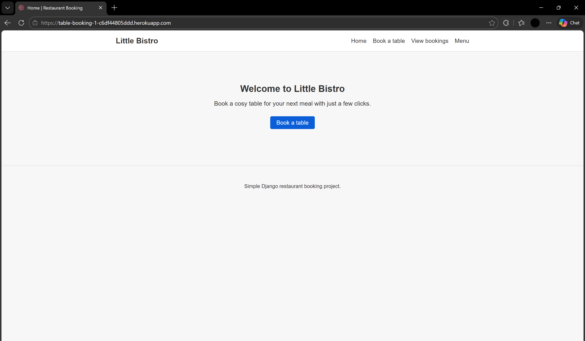

  
Browser Testing Firefox

  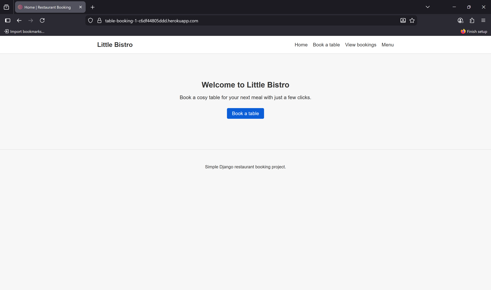

### User Story Testing

The user stories below are the same ones listed in [User Stories](#user-stories). I checked each one against the live app and noted how the project supports it and how I tested it.

| User story | How the project meets it | How I tested it | Result |
|------------|----------------------------|-------------------|--------|
| As a user, I want to see clear instructions so that I understand how to make a reservation. | The **Home** page has a welcome heading and short explanation; the nav labels (**Book a table**, **View bookings**, **Menu**) make the flow obvious. The booking form uses clear labels for each field. | Read the home page and followed the nav to the booking page; checked that text and labels explain what to do. | Pass |
| As a user, I want to submit a booking quickly using a simple, easy-to-use form. | **Book a table** opens one form with name, email, phone, date (picker), time (dropdown), table preference, guests, and optional special request. One **Save booking** action submits it. | Filled the form with valid data and submitted; confirmed redirect and success message. | Pass |
| As a user, I want my booking details to be saved so I can review them later (on the site). | Bookings are stored in the **database**. Users can open **View bookings** anytime to see saved reservations for the same site. | Created a booking, then opened **View bookings** in the same session; booking appeared in the list. Refreshed the page and the booking was still there. | Pass |
| As a user, I want the app to work smoothly on both mobile and desktop so I can book from anywhere. | Layout is responsive (CSS, mobile-first approach). Navigation and forms stay usable on smaller widths. | Used Chrome DevTools device mode and resized the window; tested Home, booking form, and list on narrow and wide screens. | Pass |
| As a user, I want to edit or cancel my booking details before confirming, in case I make a mistake. | **Before saving a new booking**, you can change any field on the form. **After saving**, you can **Edit** a booking or **Delete** it (with a confirmation step on the delete page). | Typed wrong details, corrected them before Save; after saving, used Edit and Delete and checked messages. | Pass |
| As a user, I want to see instant feedback if a time slot is unavailable so I can choose another option. | The app blocks **double bookings** for the same date, time, and table preference, and limits how many **unassigned** bookings can share one slot. Django shows validation errors on the form when rules are broken. | Tried to book the same table, date, and time twice; tried invalid cases (e.g. past date, too many guests for the table). Error messages appeared and I could change date, time, or table. | Pass |

**Summary:** Each user story is covered by the current features. Testing was done on the [deployed Heroku site](https://table-booking-1-c6df44805ddd.herokuapp.com/) and matched with the behaviour described in the [Features](#features) section.

## Deployment

The site is deployed on **Heroku**. The live app is at [Little Bistro](https://table-booking-1-c6df44805ddd.herokuapp.com/).

### Environment variables (security)

Secrets are **not** stored in the GitHub repository. They are set as **Config Vars** on Heroku (or in a local `.env` file for development — `.env` is listed in `.gitignore`).

| Variable | Purpose |
|----------|---------|
| `SECRET_KEY` | Django signing key — required. Generate a long random string; never commit it. |
| `DEBUG` | Set to `False` on Heroku so error pages are not exposed to visitors. |
| `DATABASE_URL` | Provided automatically when you attach Heroku Postgres. |

### Local development

1. Copy `.env.example` to `.env` in the project root.
2. Set `SECRET_KEY` (see the comment in `.env.example` for how to generate one).
3. Set `DEBUG=True` in `.env` for detailed error pages while building the project.

### Heroku (summary)

1. Create a Heroku app and connect the GitHub repo (or use `git push heroku main`).
2. In the Heroku dashboard: **Settings → Config Vars** — add `SECRET_KEY` and `DEBUG=False`.
3. Add the **Heroku Postgres** add-on if needed; `DATABASE_URL` is set automatically.
4. Deploy; the `Procfile` runs `release: python manage.py migrate` so the database is migrated on deploy.

After changes: commit and push to GitHub, then deploy to Heroku as usual.

  ---
  

## Credits

- **Favicon Icons**: All favicon icons used in this project are from [Flaticon](https://www.flaticon.com/)

I would like to thank everyone involved in this project for their help and advice.
